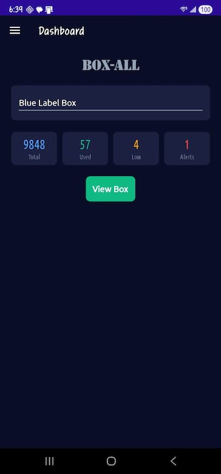
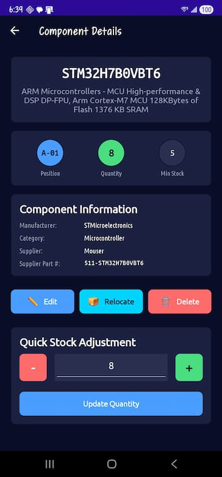

# BOX-ALL — Electronic Component Inventory Manager

**A .NET MAUI Android app for managing electronic components stored in [AideTek](https://aidetek.com) compartment storage boxes.**

> Published with permission from AideTek.

<p align="center">
  
</p>


---

## What Is BOX-ALL?

BOX-ALL is a mobile inventory companion for anyone using AideTek's compartment storage boxes (BOXALL-144, BOXALL-96-AS, and others) to organize electronic components. The app provides a digital twin of your physical storage: a color-coded grid that mirrors your box layout, making it easy to see at a glance what's stored where, what's running low, and where empty compartments are.

It replaces spreadsheet-based tracking with a purpose-built mobile tool designed for workshop and lab use.

### Key Features

- **Grid visualization** — Canvas-rendered compartment grids that match your physical box layout. BOXALL-144 (12×12 uniform) and BOXALL-96 (mixed: 72 small + 12 large + 12 medium) are fully supported. Renders 144 compartments in under 100ms.
- **Component management** — Add, edit, delete, relocate components. Track part number, description, manufacturer, category, quantity, minimum stock level, supplier info, value, package, unit price, and more.
- **Stock-level color coding** — Green (in stock), yellow (low stock), red (out of stock), dark blue (empty). Visible on the grid at a glance.
- **Multi-box support** — Manage multiple boxes from a single dashboard with per-box statistics.
- **Bulk import from Mouser orders** — A two-stage workflow using Excel + Script Lab to prepare orders, then import them on the phone (see below).
- **Sync export** — Export your entire inventory as a JSON snapshot for integration with the Excel-side tooling.
- **Offline-first, local storage** — All data stored as JSON in app-private storage. No cloud account required. No internet needed.

---

## Supported Box Types

| Box Type | Layout | Compartments | Status |
|---|---|---|---|
| BOXALL-144 | 12 × 12 uniform grid | 144 | ✅ Fully supported |
| BOXALL-96-AS | Mixed grid (small + large + medium) | 96 | ✅ Fully supported |
| BOXALL-48 | — | 48 | 🔜 Planned |
| BOXALL-40 | — | 40 | 🔜 Planned |
| BOXALL-24 | — | 24 | 🔜 Planned |

Anti-static (AS) variants use the same grid layout as their standard counterparts.

---

## Import & Export System

BOX-ALL includes a two-tier import system optimized for processing supplier orders. The idea is simple: it's much easier to assign box names and compartment positions on a desktop than one-by-one on a phone. The computer prepares the data; the phone imports it.

### Overview

**Step 1 — Export sync file (Phone)**
Open the BOX-ALL app → Dashboard → "Synchronize". This generates `boxall_status.json` in `/Documents/BOX-ALL/export/` containing your current inventory. Transfer it to your PC via USB or cloud drive. *(Skip this step on your very first import.)*

**Step 2 — Prepare the order (Computer)**
Open your Mouser order file (`.xls` or `.xlsx`) in Excel. Run the Script Lab snippet. If you have a sync file, load it — already-imported parts will be detected and shown in green with their current location pre-filled. New parts are highlighted in yellow.

**Step 3 — Assign positions (Computer)**
For each new component, pick a `BoxName` and `Position` from the dropdown lists. Click "Validate" to check for conflicts and duplicates.

**Step 4 — Save as CSV (Computer)**
Click "Save as CSV". The snippet generates a file named `YYYY-MM-DD_mouser_ORDERNUM.csv`. Transfer it to your phone.

**Step 5 — Import (Phone)**
Open the BOX-ALL app → "Import Parts" → pick the CSV file. The app validates each row and shows a color-coded preview: ✅ Ready, ⚠️ Conflict, ⭕ Skip, ❌ Invalid. Tap "Import Selected" to store the components in their assigned boxes.

**Step 6 — Sync for next time (Phone)**
Run "Synchronize" again to update the sync file. Next time you place a Mouser order, the Script Lab snippet will know what's already in your boxes.

### Computer Side — Excel + Script Lab

The repository includes a **Script Lab snippet** (`BOX-ALL_Mouser_Import.ts`) that runs inside Excel. Script Lab is a free Microsoft Office add-in for running JavaScript/TypeScript directly in Excel.

**What it does:**

1. Reads a Mouser order file (`.xls` or `.xlsx`) using SheetJS
2. Creates a "BOX-ALL Import" worksheet with 18 standardized columns
3. Optionally loads a `boxall_status.json` sync file from the phone to detect already-imported parts
4. Highlights `BoxName` and `Position` columns for manual assignment with dropdown validation
5. Validates the worksheet for conflicts and duplicates
6. Saves the result as a properly formatted CSV file

**Re-order detection:** When you load a sync file, parts that are already stored in a box (matched by SalesOrderNumber + SupplierPartNumber) are shown in green with their current location pre-filled. Only new parts need manual assignment.

**Dropdown validation:** BoxName shows all boxes from the sync file (sorted A→Z). Position shows valid positions for all box types. Category provides a predefined list for consistency.

### Phone Side — BOX-ALL App

The app's bulk import reads BOX-ALL-format CSV files (not raw Mouser CSVs) and provides a preview before importing:

- **Ready** — Box exists, position is valid and empty → will be imported
- **Conflict** — Position is already occupied → user can choose to overwrite
- **Skip** — BoxName or Position not filled in
- **Invalid** — Box doesn't exist or position format is wrong

After import, run **Sync Export** from the dashboard to generate an updated `boxall_status.json` for the next order cycle.

### BOX-ALL CSV Format

The CSV uses 18 columns:

```
BoxName, Position, PartNumber, Description, Manufacturer, Category,
Quantity, MinStock, Supplier, SupplierPartNumber, Value, Package,
Tolerance, Voltage, UnitPrice, Notes, DatasheetUrl, SalesOrderNumber
```

You can create these manually or use the Script Lab snippet to generate them from Mouser orders.

---

## Getting Started

### Prerequisites

- Visual Studio 2022 with .NET MAUI workload
- .NET 9.0 SDK
- Android device or emulator (API 34+)

### Build & Run

```bash
# Clone the repository
git clone https://github.com/YOUR_USERNAME/BOX-ALL.git

# Open in Visual Studio 2022
# Set the Android device as the target
# Build and deploy (F5)
```

### Setting Up the Script Lab Snippet

1. Install [Script Lab](https://learn.microsoft.com/en-us/office/dev/add-ins/overview/explore-with-script-lab) in Excel
2. Open Script Lab → Import
3. Paste the contents of `BOX-ALL_Mouser_Import.ts`
4. Open a Mouser order file in Excel
5. Run the snippet

---

## App Architecture

- **Framework:** .NET MAUI 9.0 (Android target)
- **Pattern:** MVVM with CommunityToolkit.Mvvm
- **Storage:** JSON files in app-private directory (no SQLite, no cloud)
- **Grid rendering:** Custom `IDrawable` canvas rendering for performance
- **Navigation:** Shell-based with flyout menu
- **DI:** Services registered as singletons (data) and transient (ViewModels, Pages)

### Project Structure

```
BOX-ALL/
├── Models/           # Component, BoxData, BoxRegistryItem, etc.
├── Services/         # FileService, BoxRegistryService, BoxDataService,
│                     # ExportImportService, SyncExportService, BulkCsvParserService
├── ViewModels/       # MVVM ViewModels with CommunityToolkit
├── Views/            # XAML pages (Dashboard, BoxView, AddComponent, Import, etc.)
├── Drawables/        # GridDrawable (144), GridDrawable96 — canvas renderers
├── Helpers/          # PositionHelper — compartment position generation/validation
└── Resources/        # Fonts (Ubuntu family), colors, images, splash screen
```

### Storage Layout

```
App-private storage:
├── boxes.json                    # Box registry (list of all boxes)
├── settings.json                 # App preferences
└── boxes/
    └── box_xxxx_name.json        # Individual box data with all components

Public Documents (for sync):
└── Documents/BOX-ALL/export/
    └── boxall_status.json        # Sync snapshot for Script Lab integration
```

---

## Screenshots

<p align="center">
  
  &nbsp;&nbsp;
  
  &nbsp;&nbsp;
  
</p>

<p align="center">
  <em>Dashboard → Grid View → Component Details</em>
</p>

---

## Dependencies

| Package | Version | Purpose |
|---|---|---|
| .NET MAUI | 9.0 | Cross-platform UI framework |
| CommunityToolkit.Mvvm | 8.4.0 | MVVM source generators and helpers |
| System.Text.Json | built-in | JSON serialization |

The Script Lab snippet uses [SheetJS (xlsx)](https://sheetjs.com/) for reading Mouser `.xls`/`.xlsx` files.

---

## Roadmap

- [ ] Additional box types (BOXALL-48, BOXALL-40, BOXALL-24)
- [ ] Search across all boxes by part number, description, or category
- [ ] Settings page
- [ ] Component photos / barcode scanning
- [ ] Position dropdown filtering by box type in Script Lab
- [ ] Cloud sync (optional)

---

## About AideTek Boxes

[AideTek](https://aidetek.com) manufactures compartment storage boxes designed for organizing small electronic components like resistors, capacitors, ICs, and connectors. Their BOXALL series features snap-close lids, ESD-safe variants, and standardized grid layouts that make them popular among electronics hobbyists and professionals.

This app is published with AideTek's permission and is not affiliated with or endorsed by AideTek.

---

## License

<!-- TODO: Choose license — MIT recommended -->

MIT License — see [LICENSE](LICENSE) for details.

---

## Acknowledgments

- [AideTek](https://aidetek.com) for permission to reference their product line
- [Script Lab](https://learn.microsoft.com/en-us/office/dev/add-ins/overview/explore-with-script-lab) by Microsoft for enabling the Excel integration
- [SheetJS](https://sheetjs.com/) for XLS/XLSX parsing in the browser
